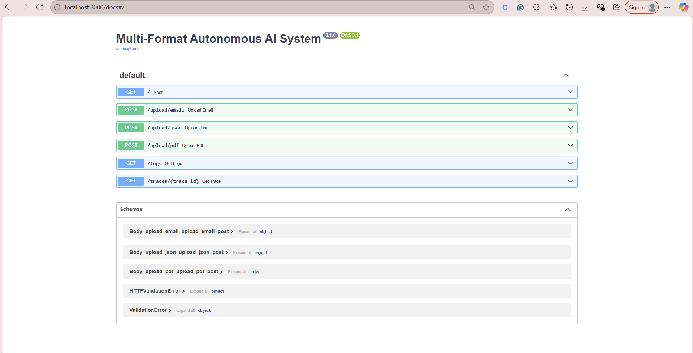

# 📦 Multi-Format Autonomous AI System

**Made by Vidhi Jaju**

---

## 📖 Overview

A powerful **multi-agent AI system** that autonomously processes **Email, JSON, and PDF inputs**, classifies both the **file format** and **business intent**, routes them to specialized agents for contextual processing, and dynamically chains follow-up actions like **alerts**, **summaries**, or **risk flags** — all while maintaining a **traceable log** for audit and debugging.

---

## ✨ Features

* 🎛️ **Classifier Agent:** Detects the input format (Email/JSON/PDF) and business intent (RFQ, Complaint, Invoice, Regulation, Fraud Risk).
* 📧 **Email Agent:** Extracts sender, urgency, issue/request, and detects tone. Automatically triggers escalations or logs based on context.
* 📝 **JSON Agent:** Validates schema fields from webhook-like data and flags anomalies.
* 📄 **PDF Agent:** Extracts invoice and policy data. Flags invoices over ₹10,000 or policy mentions of compliance terms like *GDPR*, *FDA*, etc.
* 🚦 **Action Router:** Simulates REST calls to systems like CRM, Risk Management, or logging services.
* 📝 **Shared Memory Store:** Centralized logging system capturing metadata, extracted fields, triggered actions, and agent decision traces using unique trace IDs.
* 🖥️ **Simple UI:** Intuitive upload form and full API docs via Swagger.
* 🐳 **Dockerized:** Deployable anywhere using Docker Compose.

---


## ⚙️ Setup

### 🔧 Requirements

* **Docker (Recommended)** or **Python 3.10+** with pip

### 🚀 Running with Docker

```bash
docker build -t multiagent-ai-system .
docker run -p 8000:8000 multiagent-ai-system
```

### 💻 Running Locally

```bash
pip install -r requirements.txt
uvicorn api.main:app --reload
```

---

## 📊 Usage

* 📑 Go to: [http://localhost:8000/](http://localhost:8000/) → Upload files
* 📖 API Docs: [http://localhost:8000/docs](http://localhost:8000/docs)
* 📂 Upload files from `static/sample_inputs/`
* 📜 View logs at: `/logs`
* 📌 View individual traces at: `/traces/{trace_id}`

---

## 📄 Sample Inputs

* 📧 `static/sample_inputs/sample_email.eml`
* 📊 `static/sample_inputs/sample_webhook.json`
* 🧾 `static/sample_inputs/sample_invoice.pdf` (add a real PDF for full test)

---

## 📒 Output Logs

All metadata, extracted fields, actions, and agent decisions are persistently logged in **SQLite (`memory_store.db`)**.

📝 Access logs via:

* `GET /logs`
* `GET /traces/{trace_id}`

---

## 📁 Project Structure

```
project/
├── agents/
│   ├── classifier_agent.py
│   ├── email_agent.py
│   ├── json_agent.py
│   └── pdf_agent.py
├── api/
│   └── main.py
├── memory/
│   └── memory_store.py
├── router/
│   └── action_router.py
├── utils/
│   ├── pdf_utils.py
│   ├── email_utils.py
│   └── json_utils.py
├── static/
│   └── sample_inputs/
├── requirements.txt
├── Dockerfile
└── README.md
```

---

## 📸 Screenshots





---

## 👩‍💻 Developed By

**Vidhi Jaju**

